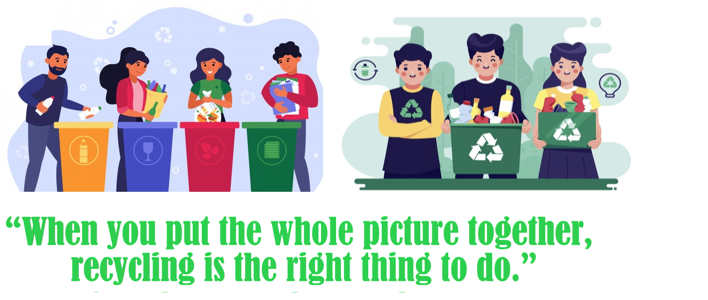

<h1 align="center">PlastiDex-Web</h1>

## Inspiration

Plastic. A useful polymer but harmful one at the same time. Plastic recycling is
a must to conserve our environment and decrease the unethical disturbances
caused due to plastic disposals. Our project aims to create a better
understanding among people about which exact plastic are they using and to help
them identify a way to dispose it in a eco-friendly manner.

## Screenshots

|  |

## Overview

An efficient tool that uses convolutional neural networks in order to detect the
code on plastic materials and gives further information on how to dispose, hoe
many times to use and what must be avoided.

## Summary

This project mainly aims to promote recycling. It helps people understand their
plastic and dispose it effectively and in a eco-friendly manner.

## Conclusion

With the amount of misinformation spreading and the climate clock ticking, it is
our responsibility to inform people and to protect our environment. This project
will help people in understanding what is necessary. It will create a certain
awareness amongst people and can be further turned into a competition of sorts
with a leaderboard, promoting recycling in a fun way. Till the day we are
completely plastic free, we can at least recycle and responsibly dispose off the
ones we do not need.

## Contributors :sparkles:

<table>
<tr>
    <td align="center">
        <a href="https://github.com/atharwa-24">
            
             
            <b>Atharwa_24</b>
        </a>
    </td>
    <td align="center">
        <a href="https://github.com/omkhairate">
            
             
            <b>Om Khairate</b>
        </a>
    </td>
    <td align="center">
        <a href="https://github.com/DhawalKhapre">
            
             
            <b>Dhawal Khapre</b>
        </a>
    </td>
    <td align="center">
        <a href="https://github.com/tejas2806">
            
             
            <b>Tejas Khairnar</b>
        </a>
    </td>
    </tr>
</table>
